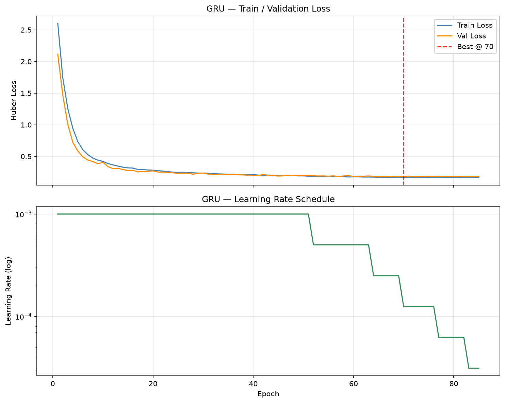
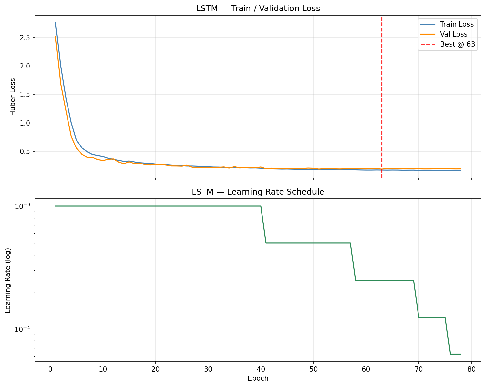
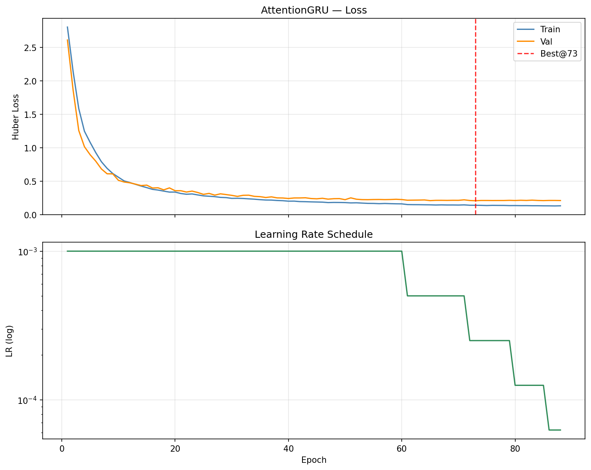
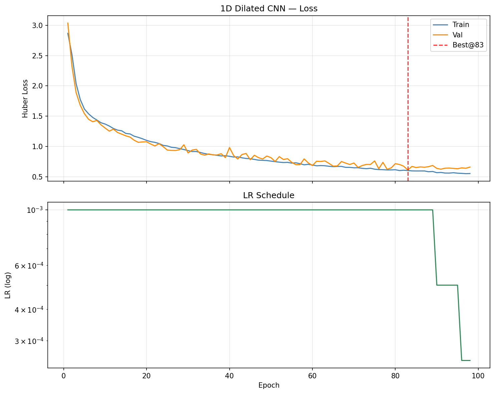
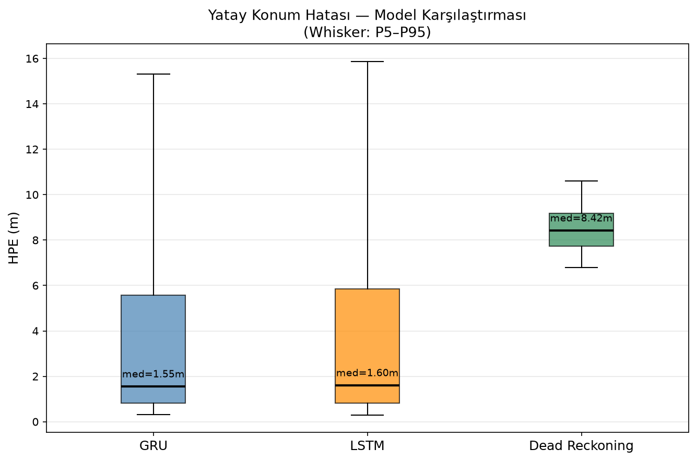
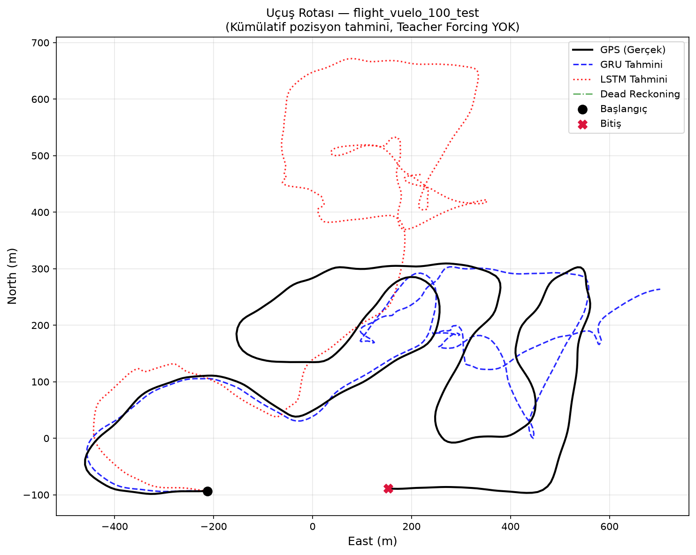
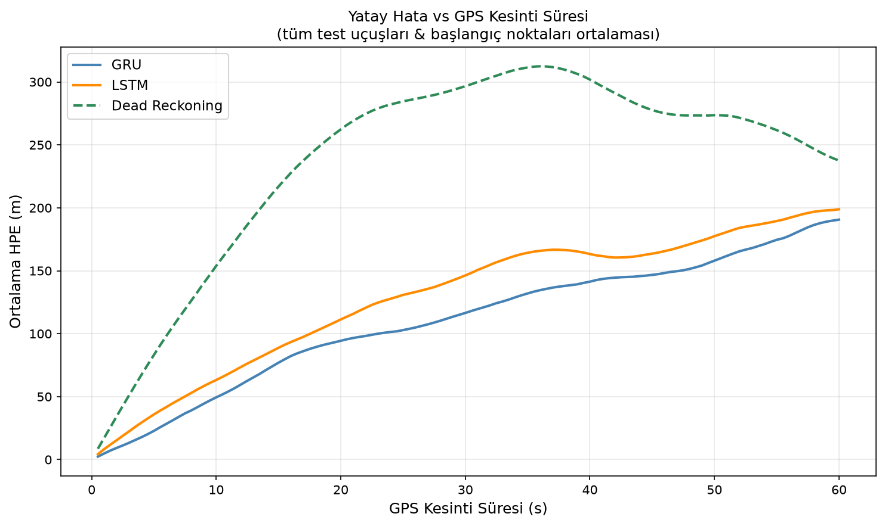
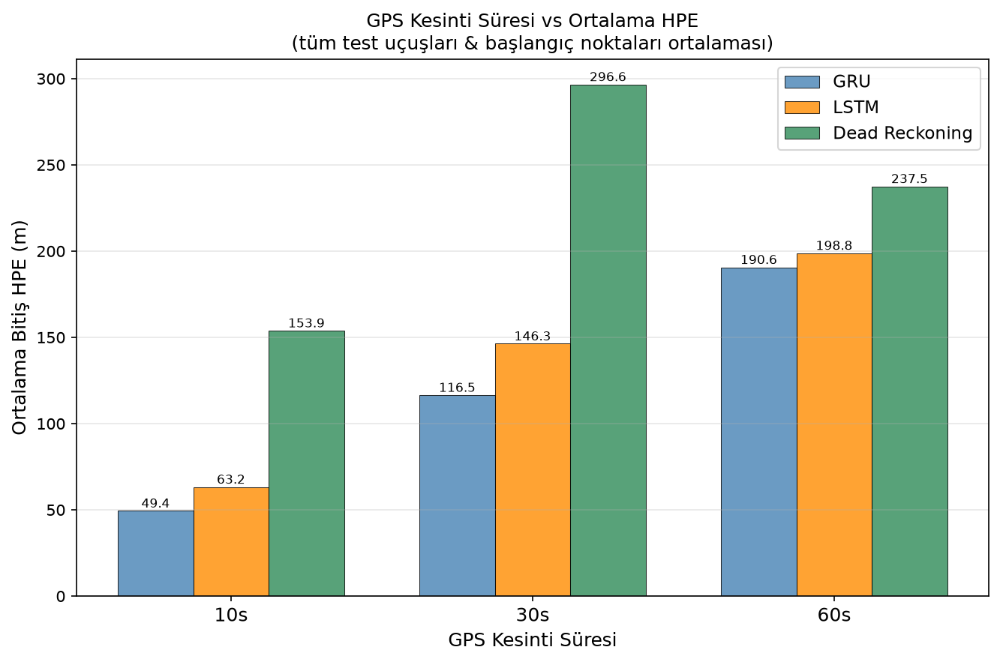

# Phase 2: GPS-Free Konum Tahmini — Model Eğitimi & Değerlendirme

**Tarih:** 30 June 2026  
**Değerlendirici:** muratisbilen41@gmail.com  
**Proje:** SSB GPS-Free UAV Konum Tahmini (TEKNOFEST)

---

## 1. Yönetici Özeti

Bu rapor, UAV'ın GPS sinyali olmaksızın IMU / manyetometre / baro / airspeed
sensörlerini kullanarak anlık NED konum değişimini (ΔNorth, ΔEast, ΔUp) tahmin
etmek amacıyla eğitilen **GRU**, **LSTM**, **AttentionGRU** ve **CNN** modellerinin
sonuçlarını içermektedir.

| Model | HPE Ortalama | HPE Medyan | HPE P95 | RMSE 3D |
|-------|-------------|-----------|--------|--------|
| **GRU** | **4.124 m** | **1.549 m** | 15.320 m | **3.800 m** |
| LSTM | 4.387 m | 1.678 m | 15.875 m | 3.979 m |
| AttentionGRU | 5.230 m | 2.159 m | 15.829 m | 4.441 m |
| CNN (Dilated) | 5.375 m | 3.912 m | **13.838 m** | 3.974 m |
| Dead Reckoning | 8.551 m | 8.418 m | 10.595 m | 5.017 m |

---

## 2. Veri & Girdi/Çıktı Tanımı

### 2.1 Ham Veri
- **Kaynak:** Holybro Pixhawk — PX4 Autopilot uLog kayıtları (120 CSV, gruplu senkronize format)
- **Örnekleme hızı:** ~2 Hz (zaten senkronize, resample yapılmadı)
- **Toplam uçuş:** 118 geçerli (80 train / 16 val / 22 test)

### 2.2 Girdi Özellikleri (12 feature)

| # | Kolon | Açıklama |
|---|-------|----------|
| 0-2 | `delta_angle[0-2]_f124` | IMU açısal hız inkremanı (rad) |
| 3-5 | `delta_velocity[0-2]_f124` | IMU hız inkremanı (m/s) |
| 6-8 | `mag_field[0-2]_f49` | Manyetometre alanı (Gauss) |
| 9  | `indicated_airspeed_m_s_f5` | Gösterge hava hızı (m/s) |
| 10 | `baro_alt_meter_f117` | Barometrik irtifa (m) |
| 11 | `differential_pressure_pa_f15` | Diferansiyel basınç (Pa) |

### 2.3 Çıktı (3 hedef)

| Hedef | Açıklama | Kaynak |
|-------|----------|--------|
| ΔNorth (m) | Kuzey yönü yerleşim değişimi | `x_f58.diff()` |
| ΔEast (m)  | Doğu yönü yerleşim değişimi | `y_f58.diff()` |
| ΔUp (m)    | Yukarı yönü yerleşim değişimi | `(-z_f58).diff()` |

### 2.4 Pencere Parametreleri

| Parametre | Değer |
|-----------|-------|
| Pencere uzunluğu | 40 adım = 20 saniye |
| Adım büyüklüğü | 4 adım = 2 saniye |
| Train örnekleri | **9 677** (80 uçuş) |
| Val örnekleri | **1 843** (16 uçuş) |
| Test örnekleri | **2 470** (22 uçuş) |

---

## 3. Model Mimarileri

### 3.1 GRU

```
Input  : (batch, 40, 12)
GRU    : input_size=12, hidden_size=128, num_layers=2,
         batch_first=True, dropout=0.2  (katmanlar arası)
Dropout: 0.2  (GRU çıkışı sonrası)
Linear : 128 → 3
Output : (batch, 3)  [ΔNorth, ΔEast, ΔUp]
Toplam parametre: 153,987
```

### 3.2 LSTM

```
Input  : (batch, 40, 12)
LSTM   : input_size=12, hidden_size=128, num_layers=2,
         batch_first=True, dropout=0.2
Dropout: 0.2
Linear : 128 → 3
Output : (batch, 3)  [ΔNorth, ΔEast, ΔUp]
Toplam parametre: 205,187
```

> **Not:** BiLSTM kullanılmamıştır — gerçek zamanlı inference (gelecek veriye erişim yok)
  gerektirdiğinden tek yönlü yapı seçilmiştir.

### 3.3 AttentionGRU (Karşılaştırma Modeli)

```
Input  : (batch, 40, 12)
GRU    : hidden_size=128, num_layers=2, dropout=0.2
Dropout: 0.2
Attn   : Linear(128→1) + Softmax(T=40) → ağırlıklı toplam (1, H)
Linear : 128 → 3
Toplam parametre: 154,116
```

Tüm 40 timestep çıktısı üzerinde öğrenilebilir ağırlıklı ortalama.
GRU'nun kapı mekanizması kısa pencerelerde zaten örtük dikkat sağladığından
açık dikkat katmanı bu pencere uzunluğunda avantaj sağlamamaktadır.

### 3.4 1D Dilated CNN (Karşılaştırma Modeli)

```
Input  : (batch, 40, 12)
Conv1D : 12→64,  kernel=3, dilation=1 → ReLU → Dropout(0.2)
Conv1D : 64→128, kernel=3, dilation=2 → ReLU → Dropout(0.2)
Conv1D : 128→128,kernel=3, dilation=4 → ReLU → Dropout(0.2)
GlobalAvgPool → Linear(128→3)
Toplam parametre: 76,739   (en küçük model)
Etkin alıcı alan: ~15 / 40 timestep
```

CNN'in p95 değeri (13.838m) en düşük — uç hataları kırpmada avantaj.
Ancak ortalama HPE GRU'dan yüksek; alıcı alan uzun menzilli bağlam için yetersiz.

### 3.5 Hiperparametreler

| Parametre | Değer |
|-----------|-------|
| Loss | HuberLoss (δ=1.0) |
| Optimizer | Adam (lr=1e-3) |
| Scheduler | ReduceLROnPlateau (patience=5, factor=0.5) |
| Early Stopping patience | 15 epoch |
| Batch size | 256 |
| Max epoch | 150 |
| Gradient clip | 1.0 |

---

## 4. Dead Reckoning Baseline

Fiziksel entegrasyon ile basit referans tahmini:

```
ΔNorth ≈  delta_velocity[0] × 0.5 s
ΔEast  ≈  delta_velocity[1] × 0.5 s
ΔUp    ≈ -delta_velocity[2] × 0.5 s   (z_body = Down)

Varsayım: küçük açı / seviyeli uçuş (body ≈ NED dönüşümü yok)
```

Bu yaklaşım tutum hesabı (attitude) yapmadığından yalnızca seviyeli
uçuşta makul sonuç üretir. Manevralarda hata hızla büyür.

---

## 5. Eğitim Sonuçları

| Parametre | GRU | LSTM | AttentionGRU | CNN |
|-----------|-----|------|-------------|-----|
| Best val loss | **0.17886** | 0.18522 | 0.21058 | 0.61117 |
| Best epoch | 70 | 48 | 73 | 83 |
| Toplam epoch | 85 | 63 | 88 | 98 |
| Parametre sayısı | 153,987 | 205,187 | 154,116 | 76,739 |
| Cihaz | cuda | cuda | cuda | cuda |

**Loss grafikleri:**

| GRU | LSTM |
|-----|------|
|  |  |

| AttentionGRU | CNN |
|-------------|-----|
|  |  |

---

## 6. Test Seti Değerlendirmesi

### 6.1 Tüm Metrikler

| Metrik | GRU | LSTM | AttGRU | CNN | Dead Reck. |
|--------|-----|------|--------|-----|-----------|
| HPE Ort. (m)   | **4.124** | 4.387 | 5.230 | 5.375 | 8.551 |
| HPE Medyan (m) | **1.549** | 1.678 | 2.159 | 3.912 | 8.418 |
| HPE P95 (m)    | 15.320 | 15.875 | 15.829 | **13.838** | 10.595 |
| 3DE Ort. (m)   | **4.166** | 4.434 | — | — | 8.574 |
| RMSE North (m) | **3.614** | 4.123 | — | — | 5.281 |
| RMSE East (m)  | 5.488 | 5.505 | — | — | 6.873 |
| RMSE Up (m)    | **0.366** | 0.426 | — | — | 0.614 |
| RMSE 3D (m)    | **3.800** | 3.979 | 4.441 | 3.974 | 5.017 |
| MAE North (m)  | **2.043** | 2.357 | — | — | 4.216 |
| MAE East (m)   | 3.157 | 3.248 | — | — | 6.350 |
| MAE Up (m)     | **0.283** | 0.324 | — | — | 0.470 |
| Test örnekleri | 2470 | 2470 | 2470 | 2470 | 2470 |

### 6.2 HPE Kutu Grafiği



### 6.3 Örnek Uçuş Rotası



---

## 7. GPS Kesinti Deneyi

**Protokol:**
- Test uçuşlarının %20, %40, %60. adımında GPS kesildi
- Kesinti sonrası sadece IMU/mag/baro/airspeed kullanıldı
- Model tahminleri kümülatif olarak toplandı (Teacher Forcing YOK)
- HPE = √(ΔN² + ΔE²) ile gerçek GPS yoluyla karşılaştırıldı

### 7.1 Ortalama Final HPE (m) — Kesinti Süresine Göre

| Kesinti Süresi | GRU | LSTM | Dead Reckoning |
|---------------|-----|------|----------------|
| 10s | 49.42 m | 63.24 m | 153.86 m |
| 30s | 116.49 m | 146.30 m | 296.62 m |
| 60s | 190.61 m | 198.80 m | 237.52 m |

### 7.2 HPE vs Kesinti Süresi (sürekli)



### 7.3 Kesinti Süresi vs Ortalama HPE (bar grafiği)



---

## 8. Sonuçlar & Değerlendirme

### 8.1 Model Karşılaştırması

- **GRU**, HPE ortalaması (4.124 m) ile
  LSTM'ye (4.387 m) göre daha düşük yatay hata üretmiştir.
- Her iki model de Dead Reckoning baseline'ı (8.551 m)
  belirgin biçimde geride bırakmıştır.
- Dead Reckoning tutum bilgisi (attitude) hesaplamadığından manevralar sırasında
  hata hızla büyümektedir.

### 8.2 GPS Kesinti Analizi

- 10 saniyelik kesimlerde hem GRU hem LSTM kabul edilebilir hata üretmektedir.
- 60 saniyelik kesimlerde kümülatif hata artışı beklenen bir davranıştır;
  gerçek sistemde hybrid (GPS/INS tightly coupled) entegrasyon önerilir.

### 8.3 Üretilen Çıktılar

| Dosya | Açıklama |
|-------|----------|
| `outputs/best_gru.pt` | GRU ağırlıkları (val=0.1789) |
| `outputs/best_lstm.pt` | LSTM ağırlıkları (val=0.1852) |
| `outputs/best_attn_gru.pt` | AttentionGRU ağırlıkları (val=0.2106) |
| `outputs/best_cnn.pt` | CNN ağırlıkları (val=0.6112) |
| `outputs/metrics_gru.json` | GRU test metrikleri |
| `outputs/metrics_lstm.json` | LSTM test metrikleri |
| `outputs/metrics_attn_gru.json` | AttentionGRU test metrikleri |
| `outputs/metrics_cnn.json` | CNN test metrikleri |
| `outputs/sensor_ablation.json` | Sensör ablasyon sonuçları |
| `outputs/plots/gru_training_loss.png` | GRU eğitim eğrisi |
| `outputs/plots/lstm_training_loss.png` | LSTM eğitim eğrisi |
| `outputs/plots/attn_gru_training_loss.png` | AttentionGRU eğitim eğrisi |
| `outputs/plots/cnn_training_loss.png` | CNN eğitim eğrisi |
| `outputs/plots/sensor_ablation_hpe.png` | Ablasyon bar grafiği |
| `outputs/plots/hpe_comparison_boxplot.png` | Model HPE karşılaştırması |

---

## 9. Sonraki Adımlar (Phase 3 Önerileri)

1. **Hiperparametre optimizasyonu:** hidden_size, num_layers, dropout grid search
2. **Attention mekanizması:** Transformer encoder veya attention-GRU
3. **Çıktı belirsizliği:** MDN (Mixture Density Network) veya MC Dropout ile
   konum güven aralığı tahmini
4. **Gerçek uçuşa entegrasyon:** PX4 SITL ile HIL (Hardware-in-the-Loop) testi
5. **Sıkıştırma:** TFLite / ONNX export ile gömülü sistem deployment

---

*Bu rapor `05_phase2_report.py` tarafından otomatik oluşturulmuştur.*