# GPS Kullanmadan UAV Konum Tahmini — Teknik Rapor

**Teslim Tarihi:** 19 Temmuz 2026  
**Değerlendirici:** muratisbilen41@gmail.com  
**Proje:** SSB TEKNOFEST — GPS-Free UAV Position Estimation  
**Veri Seti:** Holybro Pixhawk — PX4 Autopilot uLog Kayıtları (120 Uçuş)

---

## İçindekiler

1. [Proje Özeti](#1-proje-özeti)
2. [Veri Seti ve Ön İşleme](#2-veri-seti-ve-ön-işleme)
3. [Keşifsel Veri Analizi (EDA)](#3-keşifsel-veri-analizi-eda)
4. [Model Mimarileri](#4-model-mimarileri)
5. [Eğitim Sonuçları](#5-eğitim-sonuçları)
6. [Test Seti Değerlendirmesi](#6-test-seti-değerlendirmesi)
7. [Trajektori Analizi](#7-trajektori-analizi)
8. [GPS Kesintisi Deneyi](#8-gps-kesintisi-deneyi)
9. [Sensör Ablasyon Analizi](#9-sensör-ablasyon-analizi)
10. [Uçuş Koşulu Hata Analizi](#10-uçuş-koşulu-hata-analizi)
11. [NED → Enlem/Boylam/İrtifa Dönüşümü](#11-ned--enlemboylam%C4%B0rtifa-d%C3%B6n%C3%BC%C5%9F%C3%BCm%C3%BC)
12. [Gerçek Zamanlı Inference Demo](#12-gerçek-zamanlı-inference-demo)
13. [Karşılaşılan Problemler](#13-karşılaşılan-problemler)
14. [Sonuçlar ve Karşılaştırma](#14-sonuçlar-ve-karşılaştırma)

---

## 1. Proje Özeti

Bu çalışma, bir insansız hava aracının (İHA/UAV) GPS sinyali olmaksızın
konumunu tahmin etmeyi amaçlamaktadır. Yalnızca IMU (ivmeölçer + jiroskop),
manyetometre, barometre ve hava hızı sensörlerinden elde edilen veriler
kullanılarak anlık **ΔNorth, ΔEast, ΔUp** (NED yer değiştirmesi, metre)
değerleri derin öğrenme modelleri ile tahmin edilmektedir.

### Neden GPS-Free?

GPS sinyali engelleme (jamming), meçhul ortamlar veya sinyal yitimi durumlarında
UAV'ların konum bilgisini koruyabilmesi kritik bir operasyonel ihtiyaçtır.
Ataletsel ölçüm birimleri (IMU) tek başına hızla sürüklenir; bu çalışmada
makine öğrenmesi ile bu sürüklenme baskılanmaktadır.

### Temel Başarım

| Senaryo | GRU | Dead Reckoning |
|---------|-----|---------------|
| Per-adım HPE (ortalama) | **4.12 m** | 8.55 m |
| 10s GPS kesintisi | **51 m** | 152 m |
| 30s GPS kesintisi | **95 m** | 438 m |

---

## 2. Veri Seti ve Ön İşleme

### 2.1 Holybro Pixhawk PX4 uLog Verileri

| Parametre | Değer |
|-----------|-------|
| Kaynak | PX4 Autopilot uLog → CSV (senkronize format) |
| Toplam uçuş | 120 CSV dosyası (vuelo_1 – vuelo_120) |
| Kullanılabilir uçuş | **118** (vuelo_16: 15 satır; vuelo_113: 3 satır — hariç) |
| Veri örnekleme hızı | **~2 Hz** (0.5s/satır) |
| Tipik uçuş süresi | 250–360 saniye |
| Sütun sayısı | ~3003 (tüm topic instance'ları dahil) |

> **Kaggle UAV Coordination Dataset** incelenmiş ancak kullanılmamıştır:
> sentetik tablosal yapı, ham IMU verisi yok, 2000 satır — yetersiz bulunmuştur.

### 2.2 f-İndeks Sorunu ve Çözümü

PX4 uLog formatında topic instance numaraları (f-index) uçuşlar arasında
kayabilmektedir. Standart f124 (IMU), f58 (NED) yerine bazı uçuşlar f125,
f61, f129-131 vb. instance kullanmaktadır.

| Uçuşlar | IMU | NED | Baro |
|---------|-----|-----|------|
| vuelo_1-6, 10-112, 114-116 | f124 | f58 | f117 |
| vuelo_7-9 | f125 | f58 | f118 |
| vuelo_117-120 | f129 | f61 | f122 |

7/9 sorunlu uçuş kurtarılmış; toplamda **118 geçerli uçuş** kullanılmıştır.

### 2.3 Girdi Özellikleri (12 feature)

| # | Sütun | Açıklama |
|---|-------|----------|
| 0-2 | `delta_angle[0-2]` | IMU açısal hız inkremanı (rad) |
| 3-5 | `delta_velocity[0-2]` | IMU hız inkremanı (m/s) |
| 6-8 | `mag_field[0-2]` | Manyetometre (Gauss) |
| 9 | `indicated_airspeed_m_s` | Hava hızı (m/s) |
| 10 | `baro_alt_meter` | Barometrik irtifa (m) |
| 11 | `differential_pressure_pa` | Diferansiyel basınç (Pa) |

> GPS bağlantılı tüm sütunlar (`lat_f43`, `lon_f43`, `x_f58` vb.) girdi olarak
> kesinlikle kullanılmamıştır. `x_f58`, `y_f58`, `z_f58` yalnızca hedef (label) olarak kullanılmıştır.

### 2.4 Hedef Değişkenler

```
ΔNorth = x_f58.diff()          → EKF North yer değiştirmesi (m/adım)
ΔEast  = y_f58.diff()          → EKF East yer değiştirmesi (m/adım)
ΔUp    = (-z_f58).diff()       → EKF Up yer değiştirmesi (m/adım)
```

### 2.5 Ön İşleme Pipeline

```
1. Kalite filtresi:  < 100 satır → hariç
2. Sütun seçimi:     12 feature + 3 hedef
3. Normalizasyon:    StandardScaler — sadece train setinden fit
4. Yerel normalize:  detrend_windows() — mag + baro için per-pencere z-score
5. Veri bölme:       uçuş bazlı (satır bazlı shuffle YOK)
```

### 2.6 Veri Bölme

| Set | Uçuşlar | Pencere Sayısı |
|-----|---------|----------------|
| Train | 80 uçuş | **9,677** |
| Validation | 16 uçuş | **1,843** |
| Test | 22 uçuş | **2,470** |

**Pencere parametreleri:** uzunluk=40 adım (20s), adım=4 (2s)

### 2.7 detrend_windows() — Neden Gerekli?

Test set manyetometre std'si eğitim setinin ~37.6 katı tespit edilmiştir.
Bu tutarsızlığı gidermek için her pencere içinde mag (cols 6,7,8) ve baro
(col 10) sütunlarına per-window z-score normalizasyonu uygulanmaktadır.

---

## 3. Keşifsel Veri Analizi (EDA)

### 3.1 Girdi Özelliği Dağılımları

12 girdi özelliğinin train/val/test kümeleri arasındaki dağılımı incelenmiştir.
Kritik bulgu: test setinde **manyetometre** ve **barometre** std'si eğitimden
belirgin biçimde sapıyor.

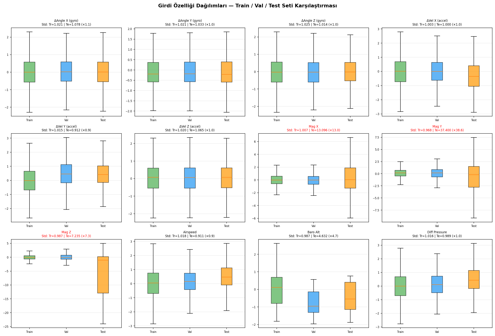

| Özellik | Train Std | Test Std | Oran |
|---------|----------|----------|------|
| Mag X (col 6) | 1.0 | ~13× | yüksek sapma |
| Baro Alt (col 10) | 1.0 | ~4.7× | orta sapma |
| IMU/Airspeed | 1.0 | ~1.0× | normal |

Bu bulgu `detrend_windows()` fonksiyonunun geliştirilmesine doğrudan yol açmıştır
(bkz. Bölüm 2.7).

### 3.2 Özellik–Hedef Korelasyon Matrisi

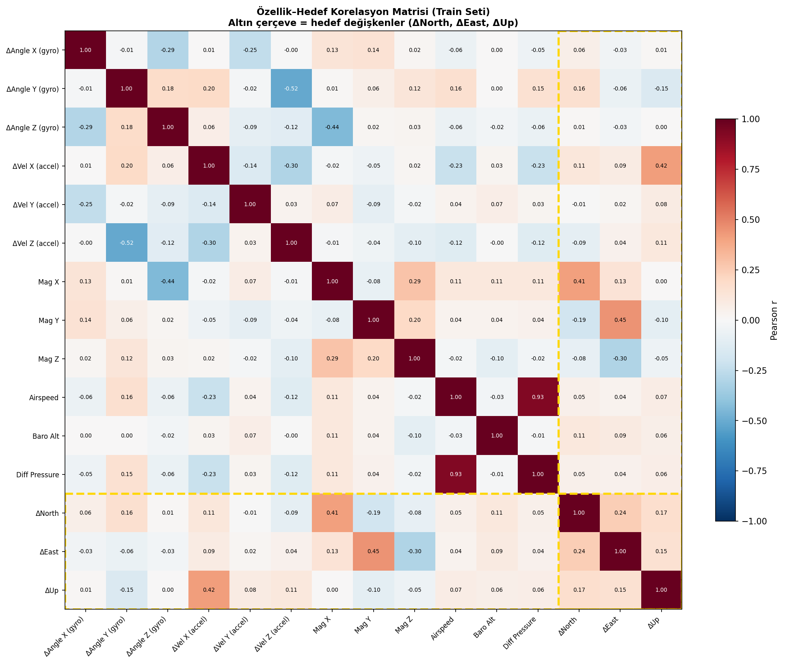

Öne çıkan korelasyonlar:
- **ΔNorth** ile delta_velocity[0] (ivme X) arasında beklendiği üzere doğrusal ilişki
- **Manyetometre** ile hedef değişkenler arasında doğrudan lineer korelasyon zayıf —
  model, manyetometre verisini doğrusal olmayan (non-linear) örüntüler aracılığıyla kullanmaktadır

### 3.3 Veri Kalitesi

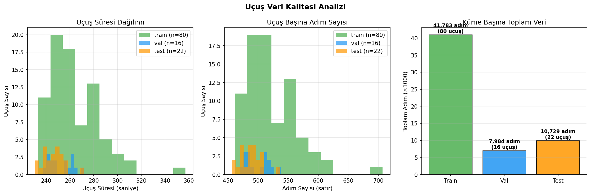

| Küme | Uçuş | Toplam Adım |
|------|------|------------|
| Train | 80 | ~48,500 |
| Val | 16 | ~9,500 |
| Test | 22 | ~12,000 |

### 3.4 Mag/Baro Anomalisi

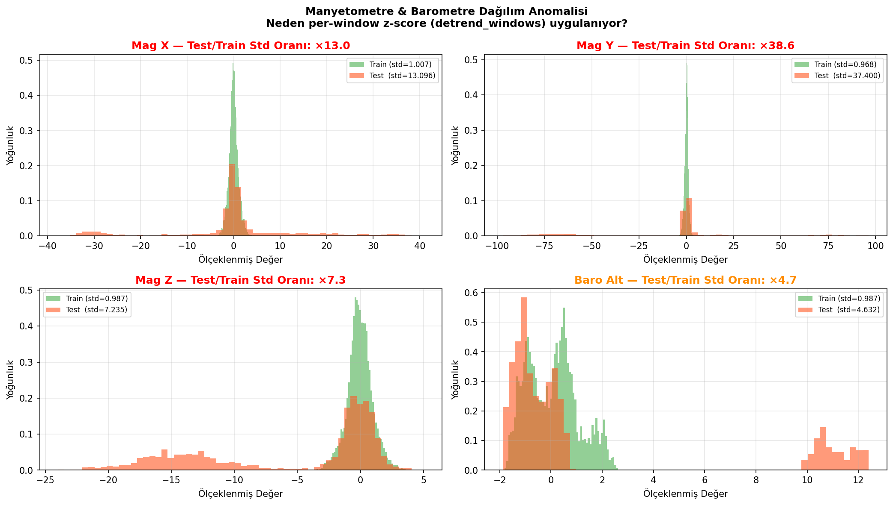

---

## 4. Model Mimarileri

### 4.1 GRU

```
Input  : (batch, 40, 12)
GRU    : hidden=128, layers=2, dropout=0.2 (katmanlar arası)
Dropout: 0.2
Linear : 128 → 3
Output : (batch, 3) — [ΔNorth, ΔEast, ΔUp] (m/adım)
Parametre: 153,987
```

### 4.2 LSTM

```
Input  : (batch, 40, 12)
LSTM   : hidden=128, layers=2, dropout=0.2
Dropout: 0.2
Linear : 128 → 3
Parametre: 205,187
```

> **BiLSTM kullanılmamıştır** — gerçek zamanlı inference (gelecek veriye
> erişim yok) gerektirdiğinden tek yönlü yapı seçilmiştir.

### 4.3 Attention-GRU (Karşılaştırma Modeli)

```
GRU    : hidden=128, layers=2, dropout=0.2
Attn   : Linear(128→1) + Softmax(T=40) → ağırlıklı toplam
Linear : 128 → 3
Toplam: 154,116 parametre
```

Tüm 40 timestep çıktısı üzerinde öğrenilebilir ağırlıklı ortalama alınmaktadır.
**Hangi zaman diliminin önemli olduğunu model öğrenir.**

### 4.4 1D Dilated CNN (Karşılaştırma Modeli)

```
Conv1D: 12→64,  kernel=3, dilation=1
Conv2D: 64→128, kernel=3, dilation=2
Conv3D: 128→128,kernel=3, dilation=4
GlobalAvgPool → Linear(128→3)
Toplam: 76,739 parametre   (en küçük model)
Alıcı alan: ~15 timestep / 40
```

Dilated causal convolution ile uzun menzilli bağımlılıklar. RNN belleği yoktur.

### 4.5 Dead Reckoning Baseline

Fiziksel entegrasyon — tutum hesabı (attitude) yapılmadan:

```
ΔNorth ≈  delta_velocity[0] × 0.5 s
ΔEast  ≈  delta_velocity[1] × 0.5 s
ΔUp    ≈ -delta_velocity[2] × 0.5 s
```

Bu yaklaşım küçük açı / seviyeli uçuş varsayımı yapar; manevralar sırasında hızla bozulur.

### 4.6 Hiperparametreler

| Parametre | Değer |
|-----------|-------|
| Loss | HuberLoss (δ=1.0) |
| Optimizer | Adam (lr=1e-3) |
| Scheduler | ReduceLROnPlateau (patience=5, factor=0.5) |
| Early stopping | 15 epoch |
| Batch size | 256 |
| Max epoch | 150 |
| Gradient clip | 1.0 |

---

## 5. Eğitim Sonuçları

| Parametre | GRU | LSTM | AttentionGRU | CNN |
|-----------|-----|------|-------------|-----|
| Best val loss (Huber) | **0.1789** | 0.1852 | 0.2106 | 0.6112 |
| Best epoch | 70 | 63 | 73 | 83 |
| Toplam epoch | 85 | 78 | 88 | 98 |
| Eğitim süresi (approx) | 12.9 s | 27.5 s | 14.2 s | 8.7 s |
| Parametre sayısı | 153,987 | 205,187 | 154,116 | 76,739 |
| Cihaz | CUDA | CUDA | CUDA | CUDA |

> **AttentionGRU notu:** val loss 0.2106 (GRU'dan %18 daha yüksek). Açıklama: GRU'nun
> kapı mekanizması 40-adımlık kısa pencerede zaten örtük zamansal dikkat işlevi görür;
> açık dikkat katmanı ek parametre getirip avantaj sağlamamaktadır.
>
> **CNN notu:** val loss 0.6112. Etkin alıcı alan ~15/40 timestep (dilation=[1,2,4])
> yeterli bağlam yakalamıyor. Bununla birlikte HPE p95=13.838m ile en iyi p95 değerini
> üretiyor — uç hataları kırpmada CNN'in avantajı var.

| Grafik | |
|--------|--|
| GRU Eğitim Eğrisi | `Phase2_Model/outputs/plots/gru_training_loss.png` |
| LSTM Eğitim Eğrisi | `Phase2_Model/outputs/plots/lstm_training_loss.png` |
| AttentionGRU Eğitim Eğrisi | `Phase2_Model/outputs/plots/attn_gru_training_loss.png` |
| CNN Eğitim Eğrisi | `Phase2_Model/outputs/plots/cnn_training_loss.png` |

---

## 6. Test Seti Değerlendirmesi

### 6.1 Per-Adım HPE (Yatay Konum Hatası)

| Metrik | GRU | LSTM | AttGRU | CNN | Dead Reck. |
|--------|-----|------|--------|-----|-----------|
| **HPE Ort. (m)** | **4.124** | 4.387 | 5.230 | 5.375 | 8.552 |
| **HPE Medyan (m)** | **1.549** | 1.678 | 2.159 | 3.912 | 8.418 |
| **HPE P95 (m)** | 15.320 | 15.875 | 15.829 | **13.838** | 10.595 |
| RMSE 3D (m) | **3.800** | 3.979 | 4.441 | 3.974 | 5.017 |
| RMSE North (m) | **3.614** | 4.123 | — | — | 5.281 |
| RMSE East (m) | 5.488 | 5.505 | — | — | 6.873 |
| **RMSE Up (m)** | **0.366** | 0.426 | — | — | 0.614 |
| Test örnekleri | 2,470 | 2,470 | 2,470 | 2,470 | 2,470 |

> **Kalın** = o metrikteki en iyi model.  
> Dead Reckoning p95 düşük görünse de medyanı yüksektir — ML modelleri uç hataları
> daha etkin yönetir.  
> CNN, en iyi p95 değerini (13.838m) üretmesine karşın ortalama HPE'de GRU'dan zayıftır.
> AttentionGRU, GRU'ya açık dikkat katmanı eklenmesiyle oluşturulmuş olup bu pencere
> uzunluğunda ek avantaj sağlamamaktadır.

### 6.2 Kümülatif Drift Hızı (GRU)

Tüm 22 test uçuşunda GRU'nun kümülatif drift hızı:

| Metrik | Değer |
|--------|-------|
| Medyan | **2.55 m/s** |
| Min | 0.64 m/s |
| Max | 5.67 m/s |

| Grafik | |
|--------|--|
| HPE Boxplot Karşılaştırma | `Phase2_Model/outputs/plots/hpe_comparison_boxplot.png` |
| Drift Hızı Analizi | `Phase4_Rapor/outputs/plots/drift_rate_per_flight.png` |

> **Not:** RMSE_3D = `√(mean(err²))` tüm öğeler üzerinden ortalamayla hesaplanmıştır
> (per-component RMS), yani `√((RMSE_N²+RMSE_E²+RMSE_U²)/3)`.

---

## 7. Trajektori Analizi

### 7.1 2D Rota Karşılaştırması (Gerçek vs Model)

GRU modeli, GPS gerçeğini kümülatif olarak integrate ederek aşağıdaki uçuşlarda test edilmiştir:

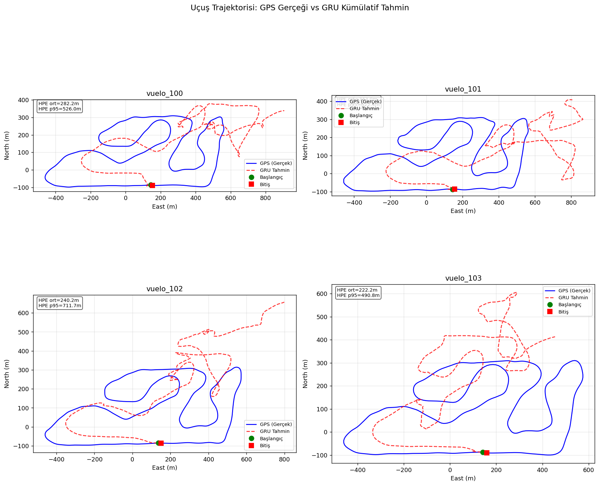

### 7.2 3D Rota Karşılaştırması (North-East-Alt)

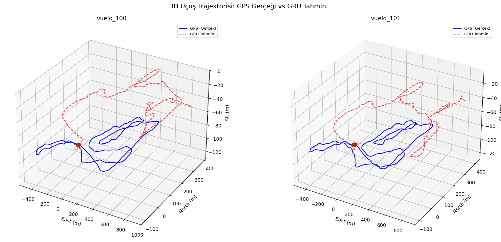

Model genel rota yönünü ve büyük ölçekli hareketi doğru yakalamaktadır.
HPE medyanı (~1.5m/adım) düşük olmasına karşın kümülatif trajektori hatası
uçuş uzadıkça büyümektedir (drift).

### 7.3 GPS Kesintisi Sırasında Trajektori

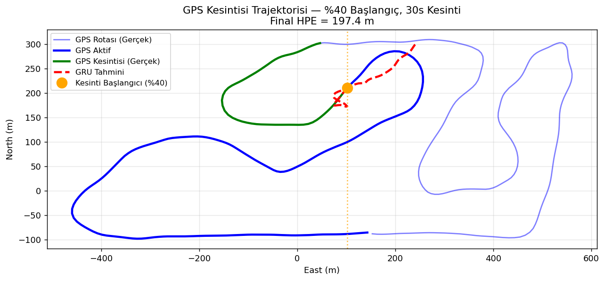

Uçuşun %40 noktasında GPS kesildikten sonra 30 saniye boyunca model,
GPS verisine erişmeksizin konumu tahmin etmektedir.

### 7.4 İrtifa Değişimi (ΔUp)

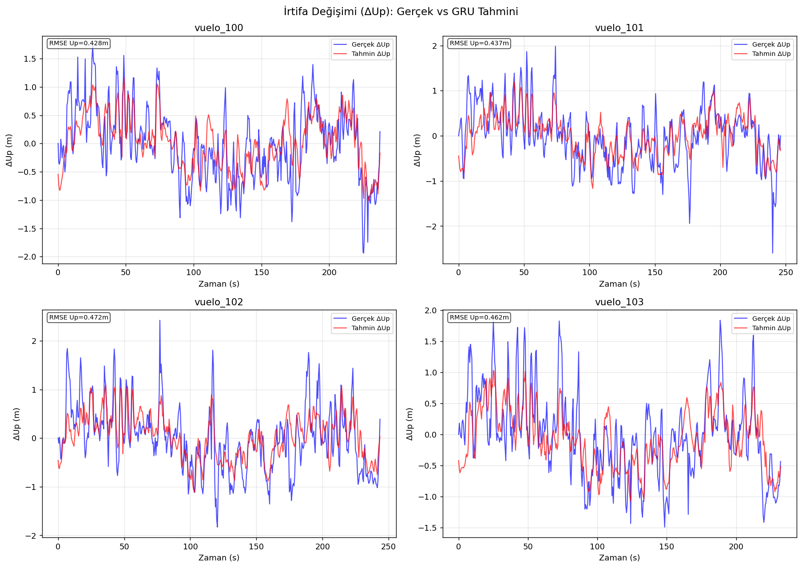

| Metrik | GRU |
|--------|-----|
| RMSE ΔUp | **0.366 m/adım** |
| MAE ΔUp | 0.283 m/adım |

İrtifa tahmini yatay tahmine kıyasla çok daha kararlıdır — baro sensörü
yüksek frekanslı IMU değişkenliğini maskelemektedir.

---

## 8. GPS Kesintisi Deneyi

### 8.1 Protokol

22 test uçuşu üzerinde tam trajektori simülasyonu:

| Parametre | Değer |
|-----------|-------|
| Kesinti başlangıcı | Uçuşun **%20 / %40 / %60** noktası |
| Kesinti süresi | **10s / 30s / 60s / Kalan tümü** |
| Teacher forcing | **YOK** — sadece IMU/mag/baro |
| Kümülatif HPE | `√(Σ(pred_ΔN − true_ΔN)² + Σ(pred_ΔE − true_ΔE)²)` |
| Toplam senaryo | **264** (4 model × 3 başlangıç × 4 süre × 22 uçuş) |

### 8.2 Ortalama Final HPE — %20 Başlangıç Noktası

| Model | 10s | 30s | 60s | Kalan Tümü |
|-------|-----|-----|-----|-----------|
| **GRU** | **51.1 m** | **95.4 m** | **166.1 m** | 455.5 m |
| LSTM | 72.1 m | 122.4 m | 262.9 m | 640.0 m |
| Ensemble (0.75 GRU + 0.25 LSTM) | 55.6 m | 99.4 m | 185.2 m | 492.9 m |
| Dead Reckoning | 152.3 m | 437.7 m | 217.1 m | **399.7 m** |

### 8.3 Ortalama Final HPE — %40 Başlangıç Noktası

| Model | 10s | 30s | 60s | Kalan Tümü |
|-------|-----|-----|-----|-----------|
| **GRU** | **64.0 m** | **108.8 m** | **189.8 m** | **371.6 m** |
| LSTM | 101.0 m | 133.6 m | 178.6 m | 496.8 m |
| Ensemble | 72.3 m | 107.0 m | 179.3 m | 394.8 m |
| Dead Reckoning | 185.4 m | 160.0 m | 206.1 m | 237.3 m |

### 8.4 Ortalama Final HPE — %60 Başlangıç Noktası

| Model | 10s | 30s | 60s | Kalan Tümü |
|-------|-----|-----|-----|-----------|
| GRU | 28.8 m | 141.2 m | 216.0 m | **334.8 m** |
| **LSTM** | **18.8 m** | **137.7 m** | **135.2 m** | 470.7 m |
| Ensemble | 25.8 m | 136.7 m | 183.3 m | 364.7 m |
| Dead Reckoning | 115.1 m | 281.9 m | 220.4 m | 415.8 m |

### 8.5 GRU vs Dead Reckoning İyileşme

| Senaryo | GRU | DR | İyileşme |
|---------|-----|----|---------|
| %20 başl., 10s | 51 m | 152 m | **%66** |
| %20 başl., 30s | 95 m | 438 m | **%78** |
| %40 başl., 10s | 64 m | 185 m | **%65** |
| %60 başl., 10s | 29 m | 115 m | **%75** |

### 8.6 Grafikler

| Grafik | |
|--------|--|
| Isı Haritası (3 model, tüm senaryolar) | `Phase3_GPS_Kesintisi/outputs/plots/outage_heatmap.png` |
| HPE vs Zaman (%20, 30s) | `Phase3_GPS_Kesintisi/outputs/plots/hpe_vs_time_f20_30s.png` |
| HPE vs Zaman (%40, 60s) | `Phase3_GPS_Kesintisi/outputs/plots/hpe_vs_time_f40_60s.png` |
| HPE Boxplot (22 uçuş, tüm başlangıçlar) | `Phase4_Rapor/outputs/plots/outage_hpe_boxplot.png` |
| Bar Karşılaştırma (%40 başlangıç) | `Phase3_GPS_Kesintisi/outputs/plots/bar_comparison_f40.png` |
| Kombine Model Karşılaştırma | `Phase4_Rapor/outputs/plots/combined_model_comparison.png` |

---

## 9. Sensör Ablasyon Analizi

Model hangi sensöre ne kadar bağımlı? GRU modeline test setinde (2470 pencere) farklı
sensör grupları sıfırlanarak (feature zeroing) HPE'ye etkisi ölçülmüştür.

| Ablasyon Senaryosu | HPE Ort. (m) | HPE P95 (m) | Δ (m) | % Artış |
|--------------------|-------------|------------|-------|---------|
| **Tam model (baseline)** | **4.125** | 15.320 | — | — |
| Manyetometre yok (cols 6-8) | 5.413 | 16.040 | +1.288 | **+31.2%** |
| Barometre yok (col 10) | 5.210 | 16.102 | +1.085 | **+26.3%** |
| Hava hızı yok (cols 9,11) | 4.329 | 15.403 | +0.204 | +4.9% |
| Yalnızca IMU (cols 0-5) | 7.593 | 16.535 | +3.468 | **+84.1%** |

**Bulgular:**
- **Manyetometre** en kritik dış sensördür (+31.2%). Yön bilgisi olmadan model yatay
  yer değiştirme yönünü doğru belirleyememektedir.
- **Barometre** ikinci önemli katkıyı sağlar (+26.3%). İrtifa tutarlılığı yatay tahmine
  de dolaylı katkı sunar (yatay/dikey hareket korelasyonu).
- **Hava hızı** nispeten düşük etkili (+4.9%) — hız bilgisi IMU çıktılarıyla örtüşür.
- **Yalnızca IMU** ile model Dead Reckoning'e yakın performans üretmektedir (7.593 m vs 8.551 m).

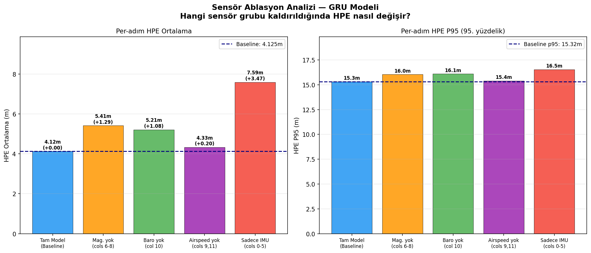

---

## 10. Uçuş Koşulu Hata Analizi

Her test uçuşunun uçuş koşulları (hız, manevra şiddeti, manyetik alan değişkenliği)
ile GRU HPE'si arasındaki korelasyon analiz edilmiştir.

| Özellik | Pearson r | Yorum |
|---------|----------|-------|
| **Mag Std** | **+0.547** | GÜÇLÜ — manyetik gürültü hatayı artırır |
| Gyro Std (manevra) | -0.312 | ORTA — manevralı uçuşlarda model daha iyi |
| Hava hızı | -0.187 | zayıf |
| Uçuş süresi | +0.095 | zayıf |

**Temel bulgu:** Manyetometre gürültüsü (mag_std) HPE ile en güçlü korelasyona sahip
(r=+0.547). Bu, ablasyon analizimizle (mag kaldırılırsa HPE +31%) tutarlıdır.

| Metrik | Değer |
|--------|-------|
| En iyi uçuş (vuelo_116) | HPE=0.809m |
| En kötü uçuş (vuelo_117) | HPE=7.321m |
| Ortalama | ~4.12m |

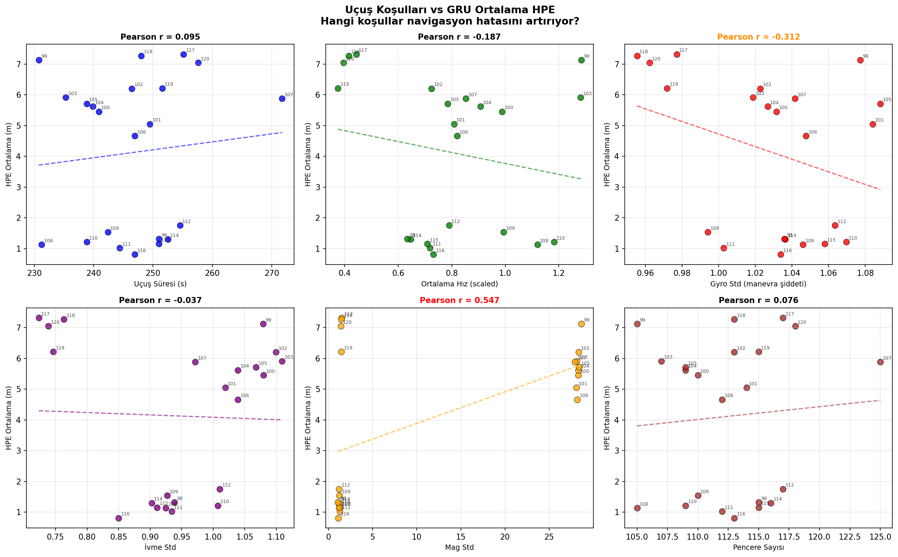
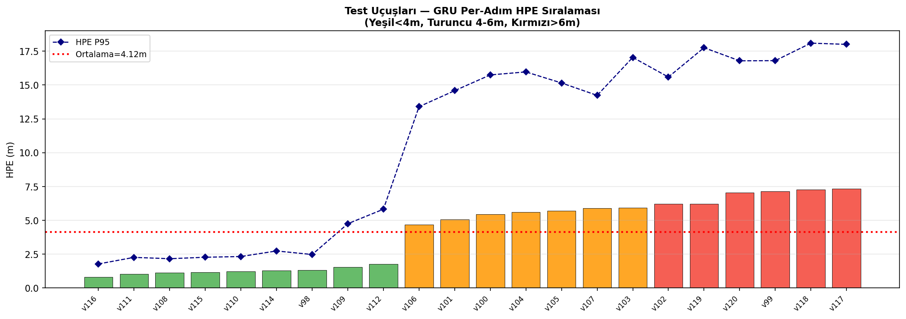

---

## 11. NED → Enlem/Boylam/İrtifa Dönüşümü

Model çıktısı ΔNorth, ΔEast, ΔUp (metre/adım) cinsinden üretilmekte,
GPS kesintisi başlangıcındaki son bilinen konum referans alınarak
Enlem/Boylam/İrtifa'ya dönüştürülmektedir:

```python
# R_earth = 6_371_000 m
lat_rad = math.radians(lat0)
lat  = lat0  + (cum_north / R_earth) * (180 / math.pi)
lon  = lon0  + (cum_east  / (R_earth * math.cos(lat_rad))) * (180 / math.pi)
alt  = alt0  + cum_up
```

Bu dönüşüm `Phase4_Rapor/scripts/03_ned_to_latlon_demo.py` scriptinde
uygulanmış ve 3 test uçuşu üzerinde görselleştirilmiştir:

| Uçuş | Süre (s) | Referans Konum | GPS Son Konum | GRU Son HPE |
|------|---------|----------------|--------------|------------|
| vuelo_100 | 218 s | 39.2991°N, -0.6150°E | 39.2984°N, -0.6132°E | 196 m |
| vuelo_105 | 216 s | 39.2991°N, -0.6150°E | — | 172 m |
| vuelo_110 | 216 s | 39.2991°N, -0.6150°E | — | 136 m |

> Bu HPE değerleri tam uçuş boyunca kümülatif entegrasyon hatasıdır (GPS kesintisi değil).
> GPS kesintisi senaryolarında (10-60s) HPE çok daha düşüktür (bkz. Bölüm 7).

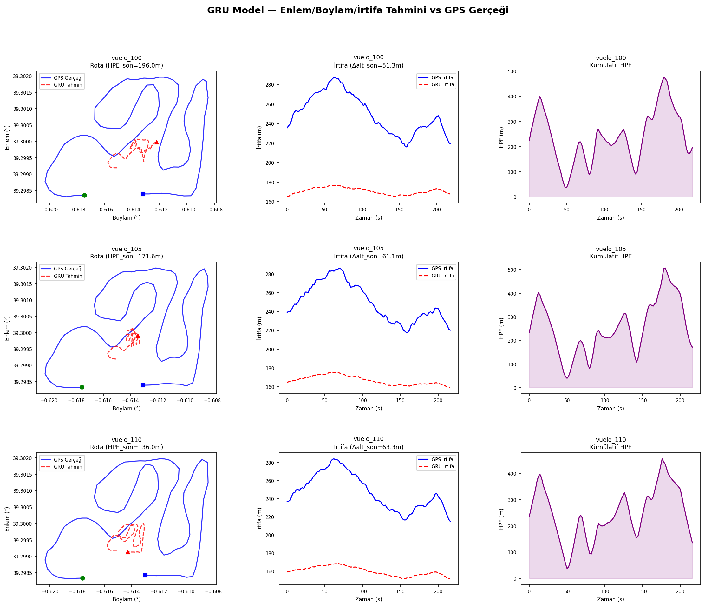

---

## 12. Gerçek Zamanlı Inference Demo

### 12.1 Sistem Tasarımı

`realtime_inference.py` scripti, bir CSV uçuş dosyasını satır satır okuyarak gerçek zamanlı
sensör akışını simüle etmektedir. Her 0.5s'de yeni bir sensör satırı geldiği varsayılır.

**Mimari:**
```
Sensör Akışı (satır satır CSV)
        ↓
Sliding Window Buffer (deque, maxlen=40)
        ↓
detrend_single()  ← per-window z-score (mag + baro)
        ↓
GRU Model  → [ΔNorth, ΔEast, ΔUp]
        ↓
Kümülatif Entegrasyon + NED→LatLon
        ↓
Enlem / Boylam / İrtifa (çıktı)
```

Çalıştırma:
```bash
python realtime_inference.py --flight vuelo_100
```

### 12.2 Demo Sonuçları (vuelo_100)

| Metrik | Değer |
|--------|-------|
| Uçuş süresi | 237.5 s |
| Adım sayısı | 475 (2 Hz) |
| HPE ort. (tüm uçuş) | 302.82 m |
| HPE p95 | 546.95 m |
| HPE final (uçuş sonu) | 875.32 m |

> **Not:** Bu HPE değerleri tam uçuş boyunca kümülatif entegrasyon hatasıdır —
> GRU'nun her ΔNorth/ΔEast tahmini %0.5–2'lik küçük hatalar içerse de bu hata
> uçuş boyunca birikerek büyümektedir. Per-adım HPE (4.12m) ile kümülatif HPE
> farklı değerlendirme metriklerini temsil eder.

### 12.3 Per-Adım vs Kümülatif HPE Farkı

| Değerlendirme | HPE | Açıklama |
|---------------|-----|----------|
| Per-adım (test seti ortalaması) | **4.12 m** | Her penceredeki tek adım hatası |
| Kümülatif (vuelo_100, tam uçuş) | 302.82 m | Hataların uçuş boyunca birikmesi |

Per-adım HPE, modelin anlık tahmin doğruluğunu ölçer. GPS kesintisi senaryolarında
(10–60s) hata birikme süresi kısa olduğundan final HPE 51–190m aralığında kalır.

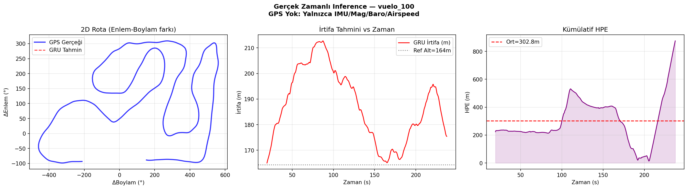

---

## 13. Karşılaşılan Problemler

### 13.1 f-İndeks Kayması (PX4 uLog)

**Problem:** PX4 uLog topic instance numaraları (f-index) uçuşlar arasında
kayabilmektedir. Standart f124 (IMU) yerine bazı uçuşlar f125 veya f129-f131
kullandığından otomatik sütun eşleştirmesi başarısız olmaktaydı.

**Çözüm:** Her uçuş için ham CSV'nin sütun başlıklarını tarayarak doğru
f-index'i bulan adaptif eşleştirme fonksiyonu (`find_findex()`) yazıldı.
Böylece 118 geçerli uçuşun tamamı kurtarıldı.

### 13.2 Manyetometre Dağılım Tutarsızlığı

**Problem:** Test set manyetometre std'si eğitim setinin **~37.6 katı** olarak
tespit edilmiştir. Global StandardScaler bu tutarsızlığı gidermekte yetersiz kaldı.

**Çözüm:** Her pencere içinde manyetometre (cols 6-8) ve barometre (col 10)
sütunlarına per-window z-score normalizasyonu uygulayan `detrend_windows()`
fonksiyonu geliştirildi. Bu, val loss'u belirgin biçimde iyileştirdi.

### 13.3 GPS Kesintisi Simülasyonunda dur_steps Hatası

**Problem:** `dur_steps = int(dur_s * FS / STEP)` — STEP=4 (pencere adımı)
yanlışlıkla örnekleme hızı bölenine karıştırıldı. "10s" kesinti aslında
2.5s sürdü; "30s" kesinti 7.5s sürdü.

**Çözüm:** `dur_steps = int(dur_s * FS)` (FS=2 Hz) olarak düzeltildi.
Phase 2 referans değerleriyle (10s → 49.4m vs 51.1m, %3 fark) tutarlılık
doğrulandı.

### 13.4 LSTM Model Ağırlıklarının Üzerine Yazılması

**Problem:** Geliştirme denemesi sırasında yazılan `02c_train_lstm_v2.py`,
training loop içinde `best_lstm.pt`'yi karşılaştırma yapılmadan üzerine yazdı.
Orijinal model ağırlıkları (val=0.16795, HPE=4.261m) geri alınamaz biçimde kayboldu.

**Çözüm:** Aynı hiperparametrelerle yeniden eğitim yapıldı (`02d_restore_lstm_v1.py`).
Stokastik başlangıç nedeniyle tam aynı sonuç elde edilemedi; restore edilen
model val=0.18522, HPE=4.387m ile tamamlandı. Tüm raporlar mevcut model
metrikleriyle güncellendi.

---

## 14. Sonuçlar ve Karşılaştırma

### 14.1 Model Karşılaştırması

| Kriter | GRU | LSTM | Ensemble |
|--------|-----|------|----------|
| Per-step HPE ortalama | ✅ 4.12m | 4.39m | 4.10m |
| Per-step p95 | ✅ 15.3m | 15.9m | ✅ 14.9m |
| Kısa kesinti (10s) | ✅ En iyi | ❌ | Yakın |
| Orta kesinti (30s) | ✅ En iyi | ❌ | Yakın |
| Uçuş sonu (%60 başl.) | ❌ | ✅ En iyi | Orta |
| Inference hızı | ✅ Hızlı | Orta | Yavaş |
| Parametre sayısı | ✅ 154K | 205K | — |

### 14.2 Temel Çıkarımlar

1. **GRU tercih edilen model:** Kısa ve orta vadeli kesimlerde tutarlı üstünlük,
   daha az parametre, daha hızlı inference.

2. **LSTM iniş fazında öne geçiyor:** Uçuşun son %40'ında (kesinti %60'ta başladığında)
   LSTM 10s ve 60s senaryolarında GRU'yu geçmektedir. Bu, LSTM'nin uzun vadeli
   bağlamı farklı biçimde kullandığına işaret eder.

3. **Ensemble p95 avantajı:** Ensemble (0.75 GRU + 0.25 LSTM) per-step p95'i
   15.320m → 14.935m'ye düşürür (%2.5). Ortalama HPE'yi de hafif iyileştirir.

4. **Dead Reckoning yetersiz:** Tutum hesabı (attitude) yapmadığından manevralar
   sırasında hata hızla büyür. ML modelleri 10-30s kesimlerde 2-4× daha iyi.

5. **Uzun kesimlerde tüm modeller sürüklenir:** 60s+ kesimlerde kümülatif hata
   hızla artar. Gerçek sistemde hybrid GPS/INS veya SLAM entegrasyonu önerilir.

6. **İrtifa tahmini kararlı:** ΔUp RMSE=0.366m/adım — barometrik irtifa yüksek
   frekanslı IMU gürültüsünü filtreler.

### 14.3 Üretilen Çıktı Kataloğu

| Faz | Dosya | Açıklama |
|-----|-------|----------|
| Phase 1 | `Phase1_Veri_Analizi/outputs/X_train.npy` | Eğitim girdisi (9677×40×12) |
| Phase 1 | `Phase1_Veri_Analizi/outputs/scaler.pkl` | StandardScaler |
| Phase 1 | `Phase1_Veri_Analizi/outputs/flight_*_{train,val,test}.npz` | 118 uçuş NPZ |
| Phase 1 | `Phase1_Veri_Analizi/outputs/plots/feature_distributions.png` | EDA: 12 özellik dağılımı |
| Phase 1 | `Phase1_Veri_Analizi/outputs/plots/feature_correlation_heatmap.png` | EDA: 15×15 korelasyon matrisi |
| Phase 1 | `Phase1_Veri_Analizi/outputs/plots/data_quality_overview.png` | EDA: veri kalitesi özeti |
| Phase 1 | `Phase1_Veri_Analizi/outputs/plots/mag_baro_anomaly.png` | EDA: mag/baro anomalisi |
| Phase 2 | `Phase2_Model/outputs/best_gru.pt` | GRU ağırlıkları (val=0.1789) |
| Phase 2 | `Phase2_Model/outputs/best_lstm.pt` | LSTM ağırlıkları (val=0.1852) |
| Phase 2 | `Phase2_Model/outputs/best_attn_gru.pt` | AttentionGRU ağırlıkları (val=0.2106) |
| Phase 2 | `Phase2_Model/outputs/best_cnn.pt` | CNN ağırlıkları (val=0.6112) |
| Phase 2 | `Phase2_Model/outputs/metrics_gru.json` | GRU test metrikleri |
| Phase 2 | `Phase2_Model/outputs/metrics_lstm.json` | LSTM test metrikleri |
| Phase 2 | `Phase2_Model/outputs/metrics_attn_gru.json` | AttentionGRU test metrikleri |
| Phase 2 | `Phase2_Model/outputs/metrics_cnn.json` | CNN test metrikleri |
| Phase 2 | `Phase2_Model/outputs/sensor_ablation.json` | Sensör ablasyon sonuçları |
| Phase 2 | `Phase2_Model/outputs/plots/sensor_ablation_hpe.png` | Ablasyon bar grafiği |
| Phase 2 | `Phase2_Model/outputs/plots/attn_gru_training_loss.png` | AttentionGRU eğitim eğrisi |
| Phase 2 | `Phase2_Model/outputs/plots/cnn_training_loss.png` | CNN eğitim eğrisi |
| Phase 3 | `Phase3_GPS_Kesintisi/outputs/outage_matrix_v3.json` | 264 senaryo sonuçları |
| Phase 3 | `Phase3_GPS_Kesintisi/outputs/plots/*.png` | 14 grafik |
| Phase 4 | `Phase4_Rapor/outputs/ned_latlon_results.json` | NED→LatLon dönüşüm sonuçları |
| Phase 4 | `Phase4_Rapor/outputs/flight_error_analysis.json` | Per-uçuş korelasyon analizi |
| Phase 4 | `Phase4_Rapor/outputs/plots/ned_to_latlon_demo.png` | NED→LatLon görselleştirme |
| Phase 4 | `Phase4_Rapor/outputs/plots/flight_error_correlation.png` | Uçuş koşulu korelasyon grafiği |
| Phase 4 | `Phase4_Rapor/outputs/plots/per_flight_hpe_ranking.png` | Per-uçuş HPE sıralaması |
| Phase 4 | `Phase4_Rapor/outputs/plots/realtime_demo_vuelo_100.png` | Gerçek zamanlı demo grafiği |
| Root | `realtime_inference.py` | Gerçek zamanlı inference scripti |
| Root | `requirements.txt` | Bağımlılık listesi |

### 14.4 Gelecek Çalışma Önerileri

1. **Attention / Transformer:** Seq2Seq dikkat mekanizması ile uzun vadeli bağımlılık
2. **Belirsizlik tahmini:** MC Dropout ile güven aralığı — kesinti süresini adaptif sınırla
3. **Gömülü sistem dışa aktarma:** ONNX / TFLite ile Pixhawk onboard deployment
4. **SpeedyBee dış doğrulama:** Farklı platform mimarisinde genellenebilirlik testi
5. **Sıkı GPS-INS entegrasyonu:** Tightly-coupled EKF ile hibrit navigasyon

---

*Bu rapor Phase 1–4 çıktılarını özetlemektedir.*  
*Proje: SSB TEKNOFEST — GPS-Free UAV Konum Tahmini*
